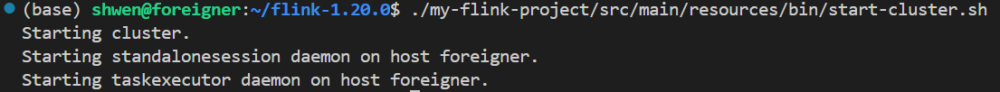
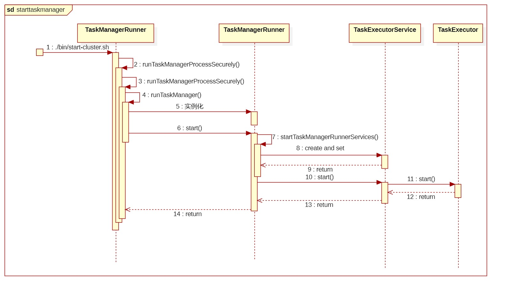
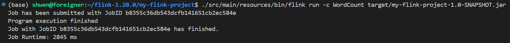
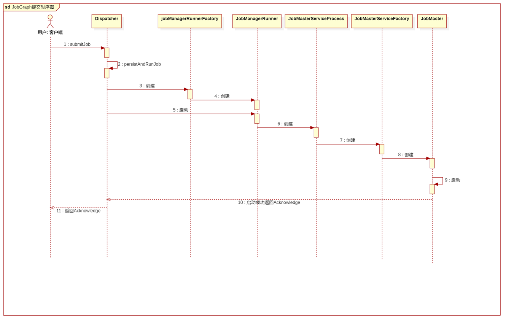

# 三. 核心流程设计分析(1)（启动环境与提交作业part）

### 1. 以单机模式在本地部署Flink：

<figure></figure>

日志中，

Starting cluster.

Starting standalonesession daemon on host foreigner.

Starting taskexecutor daemon on host foreigner.

分别对应的是flink集群启动，JobManager启动和TaskManager的启动。

**下面我们将以这三个部分为切入点，分析Flink的核心流程设计。**

***

### 2. Flink集群启动

【注1】

cluster是flink的集群环境，是分布式系统的核心概念。

【注2】

我们通过阅读.log日志文件，可以看到Flink集群启动的部分过程。但是这些类在.log中出现的顺序不能完全反映程序的执行顺序，因为Flink的执行是异步的，不同的类可能在不同的线程中执行。实际上，它们根据组件的依赖关系和初始化需求由flink框架协调执行。

所以我们结合日志内容和flink的架构，编写以下内容，包含flink集群启动的主要阶段和组件。

在[flink-runtime/src/main/java/org/apache/flink/runtime/entrypoint/ClusterEntrypoint.java](https://github.com/apache/flink/blob/master/flink-runtime/src/main/java/org/apache/flink/runtime/entrypoint/ClusterEntrypoint.java)文件中定义了集群启动的步骤和逻辑。

我们首先用下面的时序图来理解cluster启动的过程，再结合代码解读：

<figure><figcaption style="text-align: center"><p>图【1】cluster启动时序图</p></figcaption></figure>

`ClusterEntrypoint` 类包含了 `runClusterEntrypoint`、`startCluster`、`initializeServices`、`runCluster` 四个核心方法。

【注】

`ClusterEntrypoint` 是抽象类（意味着它没有实现），只能被子类继承实现。比如 `StandaloneSessionClusterEntrypoint` 是 `ClusterEntrypoint` 的子类，是 `ClusterEntrypoint` 的具体实现类，扩展了 `ClusterEntrypoint` 的功能。是 Flink 集群的入口程序，负责启动 `JobManager` 和 `TaskManager`。

**runClusterEntrypoint 方法**
* 功能: 启动集群入口的主方法（Flink 启动的起点）。
* 顺序: 是整个 Flink 启动流程的第一步。
* 工作内容: 处理异常并设置启动上下文。调用 `startCluster` 方法以执行主要逻辑。
* 关系: 顶层方法，所有其他逻辑都通过它间接调用。

**startCluster 方法**
* 功能: 提供集群的主运行逻辑。
* 顺序: 在 `runClusterEntrypoint` 调用后执行，是集群运行的核心部分。
* 工作内容: 调用 `initializeServices` 初始化配置、文件系统和插件管理器。调用 `startCluster` 启动集群组件（如调度器、资源管理器等）。
* 关系: 是集群运行的具体实现。依赖 `runCluster` 和 `initializeServices` 完成服务初始化和组件启动。

**initializeServices 方法**
* 功能: 初始化全局服务和环境。
* 顺序: 在 `runCluster` 方法中被调用，是启动的早期阶段。
* 工作内容: 加载配置: 调用 `GlobalConfiguration.loadConfiguration` 加载 flink-conf.yaml 文件。
初始化文件系统: 设置 `FileSystem`，支持分布式存储。初始化插件管理器: 加载插件（如扩展的 jar 包）。设置安全模块: 安装必要的安全模块（如 Hadoop 安全）。
* 关系: 为后续的 `startCluster` 提供环境支持。

**runCluster 方法**
* 功能: 启动集群核心组件。
* 顺序: 在 `initializeServices` 之后执行。
* 工作内容: 创建 `DispatcherRestEndpoint`，提供 REST API。创建 `StandaloneResourceManager`，管理集群资源。创建 `JobMaster`，调度作业执行。
* 关系: 依赖 `initializeServices` 提供的全局配置和环境。


**调用链:**
1. `start-cluster.sh` 调用 `StandaloneSessionClusterEntrypoint.main()`
     1. `main()` 调用 `ClusterEntrypoint.runClusterEntrypoint()`
          1. `runClusterEntrypoint()` 调用 `ClusterEntrypoint.startCluster()`
               1. `startCluster` 调用 `ClusterEntrypoint.runCluster()`
                    1. `runCluster` 调用 `ClusterEntrypoint.initializeServices()`
                         - `initializeServices` 返回 `runCluster`
                    2. `runCluster` 调用 `ClusterEntrypoint.createDispatcherResourceManagerComponentFactory()`
                       

**`createDispatcherResourceManagerComponentFactory()` 被调用的效果**：
工厂实例创建，返回一个 `DispatcherResourceManagerComponentFactory` 对象。

【注】

工厂是一种设计模式，用于创建对象，隐藏对象的创建细节，提供一个统一的接口。
所以`dispatcherResourceManagerComponentFactory`是一个接口，定义在[flink-runtime/src/main/java/org/apache/flink/runtime/entrypoint/component/DispatcherResourceManagerComponentFactory.java](https://github.com/apache/flink/blob/master/flink-runtime/src/main/java/org/apache/flink/runtime/entrypoint/component/DispatcherResourceManagerComponentFactory.java)

`DispatcherResourceManagerComponentFactory` 的职责是创建一个 `DispatcherResourceManagerComponent`，这是 Flink 中的核心组件之一，是对调度器（Dispatcher）和资源管理器（ResourceManager）组件等的封装。

在 `runCluster` 方法的后续流程中，使用这个工厂启动 `DispatcherRestEndpoint` 和 `StandaloneResourceManager`。

在创建 `DispatcherResourceManagerComponent` 实例时，构造方法会自动执行，初始化各个子模块，包括：

- `DispatcherRunner`（调度器运行器）
- `ResourceManagerService`（资源管理服务）
- `LeaderRetrievalService`（领导者信息检索服务）
- `RestService`（REST 服务）
- 设置 `terminationFuture` 和 `shutDownFuture` 用于跟踪服务的终止和关闭状态。
- 调用 `registerShutDownFuture` 方法：将 `shutDownFuture` 注册到全局终止流程中，确保组件在集群终止时能正确释放资源。
- `handleUnexpectedResourceManagerTermination` 方法: 监控 ResourceManager 的异常终止，并触发相应的错误处理逻辑。

下面粘贴了 `DispatcherResourceManagerComponent` 类的部分代码，以便更好地理解：

```java
public class DispatcherResourceManagerComponent implements AutoCloseableAsync {

    private static final Logger LOG =
            LoggerFactory.getLogger(DispatcherResourceManagerComponent.class);

    @Nonnull private final DispatcherRunner dispatcherRunner;

    @Nonnull private final ResourceManagerService resourceManagerService;

    @Nonnull private final LeaderRetrievalService dispatcherLeaderRetrievalService;

    @Nonnull private final LeaderRetrievalService resourceManagerRetrievalService;

    @Nonnull private final RestService webMonitorEndpoint;

    private final CompletableFuture<Void> terminationFuture;

    private final CompletableFuture<ApplicationStatus> shutDownFuture;

    private final AtomicBoolean isRunning = new AtomicBoolean(true);

    private final FatalErrorHandler fatalErrorHandler;

    private final DispatcherOperationCaches dispatcherOperationCaches;

    DispatcherResourceManagerComponent(
            @Nonnull DispatcherRunner dispatcherRunner,
            @Nonnull ResourceManagerService resourceManagerService,
            @Nonnull LeaderRetrievalService dispatcherLeaderRetrievalService,
            @Nonnull LeaderRetrievalService resourceManagerRetrievalService,
            @Nonnull RestService webMonitorEndpoint,
            @Nonnull FatalErrorHandler fatalErrorHandler,
            @Nonnull DispatcherOperationCaches dispatcherOperationCaches) {
        this.dispatcherRunner = dispatcherRunner;
        this.resourceManagerService = resourceManagerService;
        this.dispatcherLeaderRetrievalService = dispatcherLeaderRetrievalService;
        this.resourceManagerRetrievalService = resourceManagerRetrievalService;
        this.webMonitorEndpoint = webMonitorEndpoint;
        this.fatalErrorHandler = fatalErrorHandler;
        this.terminationFuture = new CompletableFuture<>();
        this.shutDownFuture = new CompletableFuture<>();
        this.dispatcherOperationCaches = dispatcherOperationCaches;

        registerShutDownFuture();
        handleUnexpectedResourceManagerTermination();
    }

    private void handleUnexpectedResourceManagerTermination() {
        resourceManagerService
                .getTerminationFuture()
                .whenComplete(
                        (ignored, throwable) -> {
                            if (isRunning.get()) {
                                fatalErrorHandler.onFatalError(
                                        new FlinkException(
                                                "Unexpected termination of ResourceManagerService.",
                                                throwable));
                            }
                        });
    }

    private void registerShutDownFuture() {
        FutureUtils.forward(dispatcherRunner.getShutDownFuture(), shutDownFuture);
    }

    public final CompletableFuture<ApplicationStatus> getShutDownFuture() {
        return shutDownFuture;
    }
}
```
### JobManager启动

`JobManager` 是集群的中央控制组件，管理任务的调度和故障恢复。
通过 `DispatcherResourceManagerComponent` 类中的 `DispatcherRunner()` 方法启动和运行。

启动集群后，以下组件会接连启动：

`Dispatcher (JobManager)`: 负责作业的调度、提交和监控。提供一个 REST 接口供用户提交作业。

`ResourceManager`: 管理集群资源。处理 TaskManager 的注册，并将任务分配给工作节点。

`TaskManager`: 在每个物理或虚拟节点上启动，负责执行分配的子任务。

**把上面的流程可以简化概况为：**

1. `ClusterEntrypoint` 初始化全局配置并启动集群入口程序。
2. 创建 `DispatcherResourceManagerComponent`，完成调度器和资源管理器的初始化。
3. `Dispatcher` 和 `ResourceManager` 开始运行。
4. 启动 `TaskManager`，等待资源分配并执行任务。

### taskmanager启动

<figure><figcaption style="text-align: center"><p>taskmanager启动时序图</p></figcaption></figure>

`runTaskManagerProcessSecurely()` 在文件[flink-runtime/src/main/java/org/apache/flink/runtime/taskexecutor/TaskManagerRunner.java](https://github.com/apache/flink/blob/master/flink-runtime/src/main/java/org/apache/flink/runtime/taskexecutor/TaskManagerRunner.java)中定义，
由 `TaskManagerRunner.main` 方法调用，初始化并执行 `runTaskManager()`

`runTaskManager` 方法实际负责启动 `TaskManager`，执行 `startTaskManagerRunnerService` 方法

`startTaskManagerRunnerService` 方法启动 `TaskExecutor` （内部实例化），并将其注册到 `ResourceManager`，开始接收作业和资源。

***

### 提交作业

以Flink官方仓库中提供的[flink/blob/master/flink-examples/flink-examples-streaming/src/main/java/org/apache/flink/streaming/examples/wordcount/WordCount.java](https://github.com/apache/flink/blob/master/flink-examples/flink-examples-streaming/src/main/java/org/apache/flink/streaming/examples/wordcount/WordCount.java)作业为例分析。

作业代码如下

```java
/*
 * Licensed to the Apache Software Foundation (ASF) under one or more
 * contributor license agreements.  See the NOTICE file distributed with
 * this work for additional information regarding copyright ownership.
 * The ASF licenses this file to You under the Apache License, Version 2.0
 * (the "License"); you may not use this file except in compliance with
 * the License.  You may obtain a copy of the License at
 *
 *    http://www.apache.org/licenses/LICENSE-2.0
 *
 * Unless required by applicable law or agreed to in writing, software
 * distributed under the License is distributed on an "AS IS" BASIS,
 * WITHOUT WARRANTIES OR CONDITIONS OF ANY KIND, either express or implied.
 * See the License for the specific language governing permissions and
 * limitations under the License.
 */

package org.apache.flink.streaming.examples.wordcount;

import org.apache.flink.api.common.eventtime.WatermarkStrategy;
import org.apache.flink.api.common.functions.FlatMapFunction;
import org.apache.flink.api.common.serialization.SimpleStringEncoder;
import org.apache.flink.api.java.tuple.Tuple2;
import org.apache.flink.configuration.MemorySize;
import org.apache.flink.connector.file.sink.FileSink;
import org.apache.flink.connector.file.src.FileSource;
import org.apache.flink.connector.file.src.reader.TextLineInputFormat;
import org.apache.flink.streaming.api.datastream.DataStream;
import org.apache.flink.streaming.api.environment.StreamExecutionEnvironment;
import org.apache.flink.streaming.api.functions.sink.filesystem.rollingpolicies.DefaultRollingPolicy;
import org.apache.flink.streaming.examples.wordcount.util.CLI;
import org.apache.flink.streaming.examples.wordcount.util.WordCountData;
import org.apache.flink.util.Collector;

import java.time.Duration;

/**
 * Implements the "WordCount" program that computes a simple word occurrence histogram over text
 * files. This Job can be executed in both streaming and batch execution modes.
 *
 * <p>The input is a [list of] plain text file[s] with lines separated by a newline character.
 *
 * <p>Usage:
 *
 * <ul>
 *   <li><code>--input &lt;path&gt;</code>A list of input files and / or directories to read. If no
 *       input is provided, the program is run with default data from {@link WordCountData}.
 *   <li><code>--discovery-interval &lt;duration&gt;</code>Turns the file reader into a continuous
 *       source that will monitor the provided input directories every interval and read any new
 *       files.
 *   <li><code>--output &lt;path&gt;</code>The output directory where the Job will write the
 *       results. If no output path is provided, the Job will print the results to <code>stdout
 *       </code>.
 *   <li><code>--execution-mode &lt;mode&gt;</code>The execution mode (BATCH, STREAMING, or
 *       AUTOMATIC) of this pipeline.
 * </ul>
 *
 * <p>This example shows how to:
 *
 * <ul>
 *   <li>Write a simple Flink DataStream program
 *   <li>Use tuple data types
 *   <li>Write and use a user-defined function
 * </ul>
 */
public class WordCount {

    // *************************************************************************
    // PROGRAM
    // *************************************************************************

    public static void main(String[] args) throws Exception {
        final CLI params = CLI.fromArgs(args);

        // Create the execution environment. This is the main entrypoint
        // to building a Flink application.
        final StreamExecutionEnvironment env = StreamExecutionEnvironment.getExecutionEnvironment();

        // Apache Flink’s unified approach to stream and batch processing means that a DataStream
        // application executed over bounded input will produce the same final results regardless
        // of the configured execution mode. It is important to note what final means here: a job
        // executing in STREAMING mode might produce incremental updates (think upserts in
        // a database) while in BATCH mode, it would only produce one final result at the end. The
        // final result will be the same if interpreted correctly, but getting there can be
        // different.
        //
        // The “classic” execution behavior of the DataStream API is called STREAMING execution
        // mode. Applications should use streaming execution for unbounded jobs that require
        // continuous incremental processing and are expected to stay online indefinitely.
        //
        // By enabling BATCH execution, we allow Flink to apply additional optimizations that we
        // can only do when we know that our input is bounded. For example, different
        // join/aggregation strategies can be used, in addition to a different shuffle
        // implementation that allows more efficient task scheduling and failure recovery behavior.
        //
        // By setting the runtime mode to AUTOMATIC, Flink will choose BATCH if all sources
        // are bounded and otherwise STREAMING.
        env.setRuntimeMode(params.getExecutionMode());

        // This optional step makes the input parameters
        // available in the Flink UI.
        env.getConfig().setGlobalJobParameters(params);

        DataStream<String> text;
        if (params.getInputs().isPresent()) {
            // Create a new file source that will read files from a given set of directories.
            // Each file will be processed as plain text and split based on newlines.
            FileSource.FileSourceBuilder<String> builder =
                    FileSource.forRecordStreamFormat(
                            new TextLineInputFormat(), params.getInputs().get());

            // If a discovery interval is provided, the source will
            // continuously watch the given directories for new files.
            params.getDiscoveryInterval().ifPresent(builder::monitorContinuously);

            text = env.fromSource(builder.build(), WatermarkStrategy.noWatermarks(), "file-input");
        } else {
            text = env.fromData(WordCountData.WORDS).name("in-memory-input");
        }

        DataStream<Tuple2<String, Integer>> counts =
                // The text lines read from the source are split into words
                // using a user-defined function. The tokenizer, implemented below,
                // will output each word as a (2-tuple) containing (word, 1)
                text.flatMap(new Tokenizer())
                        .name("tokenizer")
                        // keyBy groups tuples based on the "0" field, the word.
                        // Using a keyBy allows performing aggregations and other
                        // stateful transformations over data on a per-key basis.
                        // This is similar to a GROUP BY clause in a SQL query.
                        .keyBy(value -> value.f0)
                        // For each key, we perform a simple sum of the "1" field, the count.
                        // If the input data stream is bounded, sum will output a final count for
                        // each word. If it is unbounded, it will continuously output updates
                        // each time it sees a new instance of each word in the stream.
                        .sum(1)
                        .name("counter");

        if (params.getOutput().isPresent()) {
            // Given an output directory, Flink will write the results to a file
            // using a simple string encoding. In a production environment, this might
            // be something more structured like CSV, Avro, JSON, or Parquet.
            counts.sinkTo(
                            FileSink.<Tuple2<String, Integer>>forRowFormat(
                                            params.getOutput().get(), new SimpleStringEncoder<>())
                                    .withRollingPolicy(
                                            DefaultRollingPolicy.builder()
                                                    .withMaxPartSize(MemorySize.ofMebiBytes(1))
                                                    .withRolloverInterval(Duration.ofSeconds(10))
                                                    .build())
                                    .build())
                    .name("file-sink");
        } else {
            counts.print().name("print-sink");
        }

        // Apache Flink applications are composed lazily. Calling execute
        // submits the Job and begins processing.
        env.execute("WordCount");
    }

    // *************************************************************************
    // USER FUNCTIONS
    // *************************************************************************

    /**
     * Implements the string tokenizer that splits sentences into words as a user-defined
     * FlatMapFunction. The function takes a line (String) and splits it into multiple pairs in the
     * form of "(word,1)" ({@code Tuple2<String, Integer>}).
     */
    public static final class Tokenizer
            implements FlatMapFunction<String, Tuple2<String, Integer>> {

        @Override
        public void flatMap(String value, Collector<Tuple2<String, Integer>> out) {
            // normalize and split the line
            String[] tokens = value.toLowerCase().split("\\W+");

            // emit the pairs
            for (String token : tokens) {
                if (token.length() > 0) {
                    out.collect(new Tuple2<>(token, 1));
                }
            }
        }
    }
}
```

**首先我们分析一下这份代码文件**

```java
final StreamExecutionEnvironment env = StreamExecutionEnvironment.getExecutionEnvironment();
```

这行代码创建了一个流式执行环境，是Flink程序的入口。接下来的代码中，我们会使用这个env对象来构建我们的Flink程序。
如，我们可以设置环境的各种属性和方法，例如并行度，checkpoint，execute方法等。

```java
env.setRuntimeMode(params.getExecutionMode());
```

这行代码设置了Flink的执行模式，Flink支持三种执行模式：BATCH，STREAMING，AUTOMATIC。BATCH模式适用于有界数据集（批处理），STREAMING模式适用于无界数据集（流处理），AUTOMATIC模式会根据输入数据集的有界性自动选择执行模式。
这行代码从用户提供的命令行参数获取执行模式，如果参数未提供，则默认使用AUTOMATIC模式。

接下来的代码（没有粘贴）定义数据流的代码功能：决定数据源的类型（文件源或内存源），并将数据源转换成DataStream对象。如果定义了文件监控 (builder.monitorContinuously)，数据源会被视为无界数据源，从而触发STREAMING模式。
如果没有监控间隔，文件数据会被视为有界数据源，通常会触发BATCH模式（如果模式是AUTOMATIC）。

上游的数据源定义决定了下游算子的执行数据范围和处理逻辑。

```java
DataStream<Tuple2<String, Integer>> counts =
    // The text lines read from the source are split into words
    // using a user-defined function. The tokenizer, implemented below,
    // will output each word as a (2-tuple) containing (word, 1)
    text.flatMap(new Tokenizer())
        .name("tokenizer")
        // keyBy groups tuples based on the "0" field, the word.
        // Using a keyBy allows performing aggregations and other
        // stateful transformations over data on a per-key basis.
        // This is similar to a GROUP BY clause in a SQL query.
        .keyBy(value -> value.f0)
        // For each key, we perform a simple sum of the "1" field, the count.
        // If the input data stream is bounded, sum will output a final count for
        // each word. If it is unbounded, it will continuously output updates
        // each time it sees a new instance of each word in the stream.
        .sum(1)
        .name("counter");
```

这部分是算子（Operator）的定义和声明
- `flatMap算子`：
    - 名字为tokenizer
    - 数据转换算子 (Transformation Operator)
    - 将每行文本分割成单词（string），然后将每个单词转换成一个二元组(Tuple2)（word, 1）
- `keyBy算子`：
    - 数据分组算子 (Partitioning Operator)
    - 按单词（word）的值对数据分组，这样相同单词的数据会被分配到同一个task上
- `sum算子`：
    - 名字为counter
    - 聚合算子 (Aggregation Operator)
    - 对每个单词的计数（第二字段 1）求和。如果输入数据是有界的，sum算子会输出每个单词的最终计数；如果输入数据是无界的，sum算子会持续输出每次看到单词的新实例时的更新。

【注1】

Flink流式计算的核心概念是将数据从输入流一个个传递给Operator进行链式处理，最终输出结果。以source开始，sink结尾，中间operator做的操作叫做transform。

【注2】

Chain（算子链）：是Flink的优化机制，将多个算子合并到同一个任务中，从而减少网络通信开销。算子们是否组成Chain取决于Flink的任务链策略。
在实际运行中，可以通过设置 env.disableOperatorChaining() 禁用算子链，或者使用 startNewChain()、disableChaining() 控制链的边界，从而影响 StreamGraph 到 JobGraph 的生成过程。

接下来的代码（无粘贴）设置输出逻辑：如果提供了输出路径，将结果写入文件；否则，将结果打印到控制台。

```java
env.execute("WordCount");
```

这行代码执行Flink程序，提交作业并开始处理数据。env.execute方法是一个阻塞方法，直到作业执行完成才会返回。

算子的定义在调用execute方法之前，在Flink的执行环境中注册了算子，而不是立即执行。
Flink的执行环境是懒加载的，只有调用execute方法时，Flink才将这些算子构建为一个作业图（JobGraph），然后提交作业给JobManager执行。

【注1】

env.execute()调用后，每个算子（source，flatMap等）都会被解析为一个节点，StreamGraph 以有向无环图 (DAG) 的形式表示算子之间的逻辑关系。
随后，streamGragh被优化后生成JobGraph，JobGraph会合并算子链，表示具体的任务调度单元。它被提交给JobManager，JobManager会将JobGraph转换成一个Job并执行。

【注2】

JobManager根据JobGraph将任务调度到合适的TaskManager。
TaskManager是Flink的工作节点，每个算子链会被分配到一个TaskManager上的一个或多个TaskSlot中，TaskSlot是TaskManager的资源分配单元。

**提交作业**

在命令行输入
```shell
mvn clean package
```
使用Maven构建工具，编译项目并生成JAR文件

然后在命令行输入
```shell
./src/main/resources/bin/flink run -c WordCount target/my-flink-project-1.0-SNAPSHOT.jar
```
启动Flink程序

<figure></figure>

### 分析作业提交的流程

<figure></figure>

作业通过 REST API 或 CLI 提交，被Dispatcher接收。

**Dispatcher 接收作业:**

* 实现类: `org.apache.flink.runtime.dispatcher.Dispatcher`
* 职责: 集群的作业提交入口。为每个作业创建一个独立的 `JobManagerRunner` ，协调作业的调度和管理
* 方法调用: `Dispatcher.submitJob()` 接收作业并启动 JobManagerRunner，`runJob()` 调用 JobManagerRunner.start()

**JobManagerRunnerFactory**
- 实现类: `org.apache.flink.runtime.jobmaster.JobManagerRunnerFactory`
- 职责: 为每个作业生成一个对应的 JobManagerRunner 实例。

**JobManagerRunner**
- 实现类: `org.apache.flink.runtime.jobmaster.JobManagerRunner`
- 职责: 管理 `JobMasterService` 的生命周期，并与调度器集成。
- 关键方法: `start()` 启动 `JobMasterServiceProcess` ，`close()` 在作业完成或失败时，释放资源。

**JobMasterServiceFactory**
- 实现类: `org.apache.flink.runtime.jobmaster.JobMasterServiceFactory`
- 职责: 生成 JobMasterServiceProcess 实例。

**JobMasterServiceProcess**
- 实现类: `org.apache.flink.runtime.jobmaster.JobMasterServiceProcess`
- 职责: 提供 JobMaster 的运行环境。

**JobMaster**
- 实现类: `org.apache.flink.runtime.jobmaster.JobMaster`
- 职责: 构建 `ExecutionGraph` ，将任务分发给集群中的 `TaskManager`，并监控执行。
- 关键方法: `initializeFromJobGraph()` 初始化作业图，`scheduleExecutionGraph()` 调度执行图

### 总结

standalonesession daemon是JobManager的守护进程，它是flink集群的主控进程，负责：接受和管理用户提交的作业；调度任务到各个TaskManager；监控集群的状态，包括资源分配、任务执行状态等。

它启动了StandaloneSessionClusterEntrypoint类，作为JobManager的入口程序。

它监听一个网络端口（默认是 8081）用于接收用户提交的作业。通过它，用户可以访问 Flink 的 Web UI。

flink-daemon.sh脚本启动JobManager时，会调用StandaloneSessionClusterEntrypoint类的main方法，启动JobManager。
```shell
(standalonesession)
CLASS_TO_RUN=org.apache.flink.runtime.entrypoint.StandaloneSessionClusterEntrypoint
;;
```

taskexecutor daemon是TaskManager的守护进程，它是flink集群的实际执行任务的工作进程，负责：接收JobManager分配的任务；管理本地的内存、线程、网络资源；将任务执行结果返回给JobManager。

它启动了 TaskManagerRunner 类，作为 TaskManager 的入口程序。

flink-daemon.sh 启动org.apache.flink.runtime.taskexecutor

```shell
(taskexecutor)
CLASS_TO_RUN=org.apache.flink.runtime.taskexecutor.TaskManagerRunner
;;
``` 

### Flink的图结构

<figure style="text-align: center"><figcaption><p>flink的三层图结构</p></figcaption></figure>


