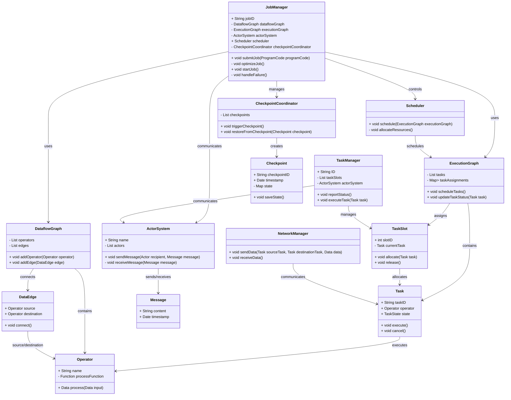

# 二. 功能分析与建模

### 1. 功能分析

Flink的作业调度机制可以用下图说明（Flink Standalone模式）：

<figure><figcaption>
Flink Standalone作业调度机制
</figcaption></figure>

Program Code通常是用户根据需求编写的Java代码，用于定义Flink应用程序的逻辑。Dataflow是用户定义的数据流程序，描述数据如何流动和处理。Optimizer优化执行计划，GraphBuilder将用户定义的程序代码转化为DataflowGraph。DataFlowGraph是一个有向图，表述了数据流程序的结构。图中的节点代表操作符，即算子（如map，filter），边代表数据流动的路径。它表示数据流的逻辑结构，包含数据流程序的操作符和它们之间的数据流动关系。DataflowGraph是Flink执行引擎（主要在runtime部分实现）理解和执行用户程序的基础。Client负责将用户的程序代码转换为DataflowGraph，并将其提交给JobManager，Client包含了Actor System【注1】来处理分布式通信，并监督作业的执行状态。

Job Manager将用户定义的逻辑计划（如DataflowGraph）转化为物理执行计划（Execution Graph【注2】）。Job Manager的Actor System负责管理整个Flink作业的生命周期，包括任务调度，资源分配，故障恢复等。它维护作业的状态，并协调Task Manager的工作。Scheduler负责将作业的执行计划转换为物理执行计划，并分配任务到不同Task Manager上执行。Checkpoint Coordinator负责管理作业的检查点机制。检查点是一种故障恢复机制，用于捕获作业的状态，包括数据状态和算子状态，它允许Flink作业在发生故障时从最近的检查点恢复。Checkpoint Coordinator会定期触发检查点，并将状态数据保存到配置的持久化存储中，它还涉及对进程间或线程间的数据共享管理。

Job Manager和Task Manager是主从关系。Task Manager（从）会定期向Job Manager（主）定期发送心跳信号，用于报告Task Manager的状态和健康状况。心跳数据通常包括Task Manager的资源使用情况、任务执行状态、检查点进度等信息。心跳机制是Flink分布式协调和故障恢复的基础，它帮助Job Manager监控集群状态并做出相应的调度决策。

Task Manager是执行任务的工作节点，负责执行数据流作业中的计算任务。一个Task Manager是一个进程，在Flink集群的工作节点上运行。Task Slot是Task Manager内的一个资源容器，用于隔离任务的资源使用。每个Task Slot可以看作是Task Manager的一个“小插槽”，用于执行一个或多个任务。Task Slot的数量可以在Task Manager启动时配置，它决定了Task Manager可以并行执行的任务数量。一个Task Slot可以包含一个或多个任务（Tasks）。这些任务通常是并行操作的一部分，每个任务处理数据流的一个分区。在Flink中，算子（Operators）是数据流中的处理单元（如map，filter），一个算子可以有零个或多个并行实例，每个并行实例对应一个任务。

Network Manager负责管理Task Manager之间的数据交换。它处理数据的序列号、网络传输和反序列化，管理数据的缓存和缓冲，确保数据可以正确地在不同Task Manager之间流动。

【注1】在Flink Standalone模式中，Client、Job Manager和Task Manager的Actor System是不同的实例，它们在不同的组件中运行，但都使用Akka框架来实现Actor System。Akka是一个用于构建分布式系统的工具，利用Actor模型处理并发和通信。每个Actor System都是独立的，负责处理其所属组件的并发和通信。

【注2】Execution Graph是Dataflow Graph的物理实现，表示如何在集群上具体执行这些操作，包含了任务的具体实例、并行度等执行时所需的详细信息。

总结来说：作业调度机制是指如何将作业的执行计划转化为具体的任务分配，并在集群中进行调度的过程。Runtime是Flink的运行时环境，负责作业的实际执行。Runtime提供了执行作业所需的基础设施，包括资源管理、任务调度、故障恢复等，它是实现Flink所有功能的基础。它包括了Job Manager和Task Manager等关键组件。Job Manager是Flink中负责管理作业生命周期的组件，管理作业的解析、优化、调度和监控，将逻辑计划转换为物理执行计划，并在集群中协调任务的执行。Task Manager是Flink中的工作节点，负责执行具体的任务，处理数据流的计算和状态管理。

我们根据上述功能分析，可以进行面向对象的建模。

### 面向对象的建模

根据上述作业调度机制的功能，我们可以定义出以下类，并将每个类的属性和方法详细地列在表中（因为类太多，画成类图导致字体太小，可读性差，所以我选取了列表的形式）。

**ActorSystem**

<table><thead><tr><th width="280">属性/方法</th><th width="65">类型</th><th>说明</th></tr></thead><tbody><tr><td>+String name</td><td>公有属性</td><td>表示 ActorSystem 的名称</td></tr><tr><td>-List&#x3C;Actor> actors</td><td>私有属性</td><td>存储当前系统中的所有 Actor</td></tr><tr><td>+void sendMessage(Actor recipient, Message message)</td><td>公有方法</td><td>向指定的 Actor 发送消息</td></tr><tr><td>-void receiveMessage(Message message)</td><td>私有方法</td><td>接收并处理消息</td></tr></tbody></table>

***

**JobManager**

<table><thead><tr><th width="234">属性/方法</th><th width="65">类型</th><th>说明</th></tr></thead><tbody><tr><td>+String jobID</td><td>公有属性</td><td>表示作业的唯一标识符</td></tr><tr><td>-DataflowGraph dataflowGraph</td><td>私有属性</td><td>保存作业的逻辑数据流图</td></tr><tr><td>-ExecutionGraph executionGraph</td><td>私有属性</td><td>保存作业的物理执行图</td></tr><tr><td>-ActorSystem actorSystem</td><td>私有属性</td><td>用于处理分布式通信</td></tr><tr><td>+Scheduler scheduler</td><td>公有属性</td><td>负责作业的任务调度</td></tr><tr><td>-CheckpointCoordinator checkpointCoordinator</td><td>私有属性</td><td>用于管理检查点机制</td></tr><tr><td>+void submitJob(ProgramCode programCode)</td><td>公有方法</td><td>提交作业并生成 DataflowGraph</td></tr><tr><td>-void optimizeJob()</td><td>私有方法</td><td>优化作业的执行计划</td></tr><tr><td>+void startJob()</td><td>公有方法</td><td>启动作业的执行</td></tr><tr><td>-void handleFailure()</td><td>私有方法</td><td>处理作业执行过程中可能出现的故障</td></tr></tbody></table>

***

**DataflowGraph**

<table><thead><tr><th width="217">属性/方法</th><th width="71">类型</th><th>说明</th></tr></thead><tbody><tr><td>-List&#x3C;Operator> operators</td><td>私有属性</td><td>数据流图中的操作符集合</td></tr><tr><td>-List&#x3C;DataEdge>edges</td><td>私有属性</td><td>表示数据流动的路径</td></tr><tr><td>+void addOperator(Operator operator)</td><td>公有方法</td><td>添加一个操作符到数据流图中</td></tr><tr><td>+void addEdge(DataEdge edge)</td><td>公有方法</td><td>为数据流图添加一条边</td></tr></tbody></table>

***

**ExecutionGraph**

<table><thead><tr><th width="221">属性/方法</th><th width="65">类型</th><th>说明</th></tr></thead><tbody><tr><td>-List&#x3C;Task> tasks</td><td>私有属性</td><td>作业的物理执行任务列表</td></tr><tr><td>-Map&#x3C;TaskSlot, List&#x3C;Task>> taskAssignments</td><td>私有属性</td><td>任务槽和任务的分配关系</td></tr><tr><td>+void scheduleTasks()</td><td>公有方法</td><td>为作业分配任务</td></tr><tr><td>+void updateTaskStatus(Task task)</td><td>公有方法</td><td>更新任务的状态</td></tr></tbody></table>

***

**Scheduler**

<table><thead><tr><th width="240">属性/方法</th><th width="76">类型</th><th>说明</th></tr></thead><tbody><tr><td>+void schedule(ExecutionGraph executionGraph)</td><td>公有方法</td><td>负责调度作业执行</td></tr><tr><td>-void allocateResources()</td><td>私有方法</td><td>为任务分配资源</td></tr></tbody></table>

***

**CheckpointCoordinator**

<table><thead><tr><th width="230">属性/方法</th><th width="69">类型</th><th>说明</th></tr></thead><tbody><tr><td>-List&#x3C;Checkpoint> checkpoints</td><td>私有属性</td><td>存储当前作业的所有检查点。</td></tr><tr><td>+void triggerCheckpoint()</td><td>公有方法</td><td>定期触发新的检查点。</td></tr><tr><td>+void restoreFromCheckpoint(Checkpoint checkpoint)</td><td>公有方法</td><td>从指定检查点恢复状态。</td></tr></tbody></table>

***

**TaskManager**

<table><thead><tr><th width="195">属性/方法</th><th width="69">类型</th><th>说明</th></tr></thead><tbody><tr><td>+String ID</td><td>公有属性</td><td>TaskManager 的唯一标识符</td></tr><tr><td>-List&#x3C;TaskSlot> taskSlots</td><td>私有属性</td><td>任务槽列表，用于资源隔离</td></tr><tr><td>-ActorSystem actorSystem</td><td>私有属性</td><td>用于处理分布式通信</td></tr><tr><td>+void reportStatus()</td><td>公有方法</td><td>定期报告自身状态</td></tr><tr><td>+void executeTask(Task task)</td><td>公有方法</td><td>执行分配到的任务</td></tr></tbody></table>

***

**TaskSlot**

<table><thead><tr><th width="231">属性/方法</th><th width="99">类型</th><th>说明</th></tr></thead><tbody><tr><td>+int slotID</td><td>公有属性</td><td>任务槽唯一标识符</td></tr><tr><td>-Task currentTask</td><td>私有属性</td><td>当前分配的任务</td></tr><tr><td>+void allocate(Task task)</td><td>公有方法</td><td>分配任务到该任务槽</td></tr><tr><td>+void release()</td><td>公有方法</td><td>释放任务槽</td></tr></tbody></table>

***

**Task**

<table><thead><tr><th width="192">属性/方法</th><th width="98">类型</th><th>说明</th></tr></thead><tbody><tr><td>+String taskID</td><td>公有属性</td><td>任务的唯一标识符</td></tr><tr><td>+Operator operator</td><td>公有属性</td><td>执行任务的操作符</td></tr><tr><td>+TaskState state</td><td>公有属性</td><td>任务的当前状态</td></tr><tr><td>+void execute()</td><td>公有方法</td><td>执行任务</td></tr><tr><td>+void cancel()</td><td>公有方法</td><td>取消任务的执行</td></tr></tbody></table>

***

**NetworkManager**

<table><thead><tr><th width="253">属性/方法</th><th width="70">类型</th><th>说明</th></tr></thead><tbody><tr><td>+ void sendData(Task sourceTask, Task destinationTask, Data data)</td><td>公有方法</td><td>发送数据到指定任务</td></tr><tr><td>+ void receiveData()</td><td>公有方法</td><td>接收数据</td></tr></tbody></table>

***

**Operator**

<table><thead><tr><th width="249">属性/方法</th><th width="99">类型</th><th>说明</th></tr></thead><tbody><tr><td><strong>+</strong> String name</td><td>公有属性</td><td>操作符的名称</td></tr><tr><td><strong>-</strong> Function&#x3C;Data, Data> processFunction</td><td>私有属性</td><td>处理数据的函数</td></tr><tr><td>+ Data process(Data input)</td><td>公有方法</td><td>处理输入数据</td></tr></tbody></table>

***

**DataEdge**

<table><thead><tr><th>属性/方法</th><th width="102">类型</th><th>说明</th></tr></thead><tbody><tr><td>+ Operator source</td><td>公有属性</td><td>数据流的起始操作符</td></tr><tr><td>+ Operator destination</td><td>公有属性</td><td>数据流的目的操作符</td></tr><tr><td>+ void connect()</td><td>公有方法</td><td>连接两个操作符</td></tr></tbody></table>

***

**Checkpoint**

<table><thead><tr><th width="257">属性/方法</th><th width="98">类型</th><th>说明</th></tr></thead><tbody><tr><td><strong>+ String c</strong>heckpointID</td><td>公有属性</td><td>检查点的唯一标识符</td></tr><tr><td>+ Date timestamp</td><td>公有属性</td><td>检查点的时间戳</td></tr><tr><td><strong>-</strong> Map&#x3C;String, Object> state</td><td>私有属性</td><td>保存作业的状态</td></tr><tr><td>+ void saveState()</td><td>公有方法</td><td>保存当前的状态</td></tr></tbody></table>

***

**Message**

<table><thead><tr><th width="196">属性/方法</th><th width="120">类型</th><th>说明</th></tr></thead><tbody><tr><td><strong>+</strong> String content</td><td>公有属性</td><td>消息内容</td></tr><tr><td>+ Date timestamp</td><td>公有属性</td><td>消息的时间戳</td></tr></tbody></table>

***

**用类图来表示**

### 数据流动

数据流动关系和方向以及在最上面的流程图以及类图中体现了，故此处不再赘述。

### 依赖关系矩阵

<table data-full-width="false"><thead><tr><th width="182">类名</th><th width="46">ActorSystem</th><th width="47">Client</th><th width="45">JobManager</th><th width="47">Scheduler</th><th width="46">CheckpointCoordinator</th><th width="46">TaskManager</th><th width="43">NetworkManager</th><th width="40">DataflowGraph</th><th width="46">ExecutionGraph</th><th width="44">TaskSlot</th><th width="46">Task</th><th width="48">Operator</th><th width="47">Checkpoint</th><th>Message</th></tr></thead><tbody><tr><td>ActorSystem</td><td>1</td><td>1</td><td>1</td><td>0</td><td>0</td><td>0</td><td>0</td><td>0</td><td>0</td><td>0</td><td>0</td><td>0</td><td>0</td><td>1</td></tr><tr><td>Client</td><td>0</td><td>1</td><td>1</td><td>0</td><td>0</td><td>0</td><td>0</td><td>1</td><td>0</td><td>0</td><td>0</td><td>0</td><td>0</td><td>0</td></tr><tr><td>JobManager</td><td>1</td><td>0</td><td>1</td><td>1</td><td>1</td><td>1</td><td>0</td><td>1</td><td>1</td><td>0</td><td>0</td><td>0</td><td>1</td><td>0</td></tr><tr><td>Scheduler</td><td>0</td><td>0</td><td>1</td><td>1</td><td>0</td><td>1</td><td>0</td><td>0</td><td>1</td><td>0</td><td>0</td><td>0</td><td>0</td><td>0</td></tr><tr><td>Checkpoint-Coordinator</td><td>0</td><td>0</td><td>1</td><td>0</td><td>1</td><td>1</td><td>0</td><td>0</td><td>0</td><td>0</td><td>0</td><td>0</td><td>1</td><td>0</td></tr><tr><td>TaskManager</td><td>1</td><td>0</td><td>1</td><td>0</td><td>0</td><td>1</td><td>1</td><td>0</td><td>0</td><td>1</td><td>1</td><td>1</td><td>1</td><td>0</td></tr><tr><td>NetworkManager</td><td>0</td><td>0</td><td>0</td><td>0</td><td>0</td><td>1</td><td>1</td><td>0</td><td>0</td><td>0</td><td>1</td><td>0</td><td>0</td><td>0</td></tr><tr><td>DataflowGraph</td><td>0</td><td>0</td><td>1</td><td>0</td><td>0</td><td>0</td><td>0</td><td>1</td><td>1</td><td>0</td><td>0</td><td>1</td><td>0</td><td>0</td></tr><tr><td>ExecutionGraph</td><td>0</td><td>0</td><td>1</td><td>0</td><td>0</td><td>1</td><td>0</td><td>0</td><td>1</td><td>0</td><td>1</td><td>1</td><td>0</td><td>0</td></tr><tr><td>TaskSlot</td><td>0</td><td>0</td><td>0</td><td>0</td><td>0</td><td>1</td><td>0</td><td>0</td><td>0</td><td>1</td><td>1</td><td>0</td><td>0</td><td>0</td></tr><tr><td>Task</td><td>0</td><td>0</td><td>0</td><td>0</td><td>0</td><td>1</td><td>1</td><td>0</td><td>0</td><td>0</td><td>1</td><td>1</td><td>1</td><td>0</td></tr><tr><td>Operator</td><td>0</td><td>0</td><td>0</td><td>0</td><td>0</td><td>0</td><td>0</td><td>0</td><td>0</td><td>0</td><td>1</td><td>1</td><td>0</td><td>0</td></tr><tr><td>Checkpoint</td><td>0</td><td>0</td><td>0</td><td>0</td><td>0</td><td>0</td><td>0</td><td>0</td><td>0</td><td>0</td><td>1</td><td>1</td><td>1</td><td>0</td></tr><tr><td>Message</td><td>0</td><td>0</td><td>1</td><td>0</td><td>0</td><td>0</td><td>0</td><td>0</td><td>0</td><td>0</td><td>0</td><td>0</td><td>0</td><td>1</td></tr></tbody></table>

<figure><figcaption>
依赖矩阵
</figcaption></figure>
