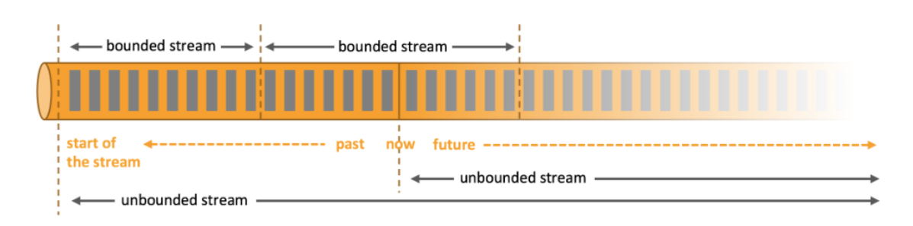
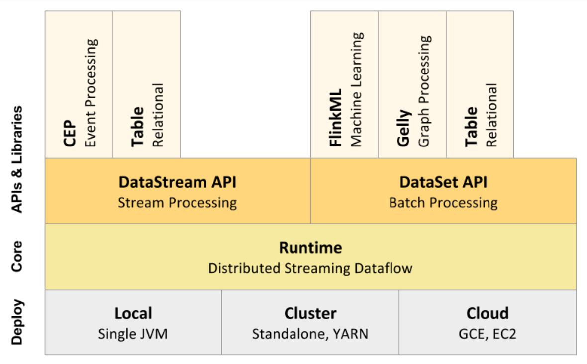

# Flink基本介绍

### Flink的历史

Flink，Stratosphere 与 Apache（时间也许有误）。

Stratosphere 是一个在 2010 至 2014 年间由德国柏林的几所大学共同进行的研究项目，该项目旨在构建一个基于数据库概念、大规模并行处理架构和 MapReduce 计算模型的分布式数据计算引擎。

2014 年 4 月，Stratosphere 的代码被复制并捐赠给了 Apache 软件基金会，成为 Apache 孵化器项目，在这个过程中，项目名称从 Stratosphere 变更为 Flink。

经过一段时间的孵化，Flink 在 2014 年 12 月成为了 Apache 软件基金会的顶级项目。

Flink 继承了 Stratosphere 的研究成果，并在此基础上发展出了强大的流处理和批处理能力。

### 什么是Flink

Apache Flink是一个开源的流处理框架，用于实时数据流的处理和分析，具有分布式、高性能的特点。它也可以完成批处理任务（将批处理，即处理有限的静态数据，视作一种特殊的流处理），成为一个统一的流和批处理平台【注1】。

我们可以用一个通俗的比喻理解Flink：有一个水龙头，水不断地从里面流出来。Flink就像一个智能的水管工，能够实施地处理这些流动的水。无论水流的速度有多快，Flink都能快速地对水流进行测量、过滤杂质、甚至改变水流的方向。Flink是一个能够实时处理大量数据流的超级工具。

【注1】流处理和批处理：

流处理是一种处理连续、实时、无界数据流的技术。它能够即时地处理数据，低延迟，无需针对整个数据集执行操作，对通过系统传输的每个数据项执行操作，通常用于需要快速响应的场景，比如监控系统、股票交易、事件驱动的应用等。它需要较高的容错性以应对数据流中的故障。

批处理是一种处理大量数据的技术，它通常在数据积累到一定量后，一次性地进行处理。这种处理方式有较高延迟，适用于不需要即时响应的场景，比如月末的报表生成，历史数据分析。因为数据是静态的，它对容错性的要求相对较低。

可以用下图形象地展示有界数据流和无界数据流的概念。

  
  <figcaption>
图【1】有界流与无界流
</figcaption>

### Flink的核心特性

1. 批流一体化：Flink能够在同一个运行时环境中支持批处理和流处理，将二者统一起来。
2. 高吞吐，低延迟：能够实现毫秒级的处理能力。
3. Exactly-one语义：支持有状态计算的Exactly-one语义，确保了数据处理的准确性。
4. 状态管理：Flink可以跟踪和存储处理过程中的状态信息。
5. 灵活的窗口操作：Flink提供了高度灵活的窗口操作，包括时间窗口、会话窗口、计数窗口等，以支持复杂的时间相关的计算，以及数据驱动的窗口操作。
6. 可扩展性：可以在不同的集群环境中运行，如本地机器、云服务或大型分布式系统，能够水平扩展至数千个节点以上。
7. 丰富的API：提供了多种编程接口，包括Java，Scala，Python。
8. 性能：Flink 在 JVM 内部实现了自己的内存管理，支持迭代计算和程序自动优化，避免了一些昂贵的操作，如 Shuffle 和排序。
9. Hadoop兼容性：Flink 能够支持 YARN，能够从 HDFS 和 HBase 中获取数据，并且可以使用 Hadoop 的格式化输入和输出。

### Flink的应用场景

* **事件驱动应用**：如互联网金融业务、点击流日志处理、舆情监控等，这些场景通常需要低延迟的数据处理。
* **数据分析应用**：如电信网络质量监控、移动应用中的产品更新和实验评估分析、消费中心的实时数据即席分析、大规模图分析等。
* **数据管道应用**：如电子商务中的实时数据查询索引构建、持续ETL等。

### Flink的架构

下图展示了Apache Flink的架构，从底层的部署环境到核心运行时系统，再到上层的API和特定功能的库。下面将对图中的每个部分进行详细的解释。

<figure><figcaption>
图【2】Flink 的核心计算架构
</figcaption></figure>

**Deploy：部署层。** 用于定义Flink应用的运行环境和部署方式。

* **Local（Single JVM）**：指在本地使用单一 JVM（Java 虚拟机）进行运行，主要用于开发和测试。
* **Cluster（Standalone, YARN）**：支持集群模式的部署，包括：
  * **Standalone**：Flink 自带的集群模式，直接在多台机器上启动 Flink 实例。
  * **YARN（Yet Another Resource Negotiator）**：一个用于大数据应用的资源管理器，支持动态资源分配和管理。
* **Cloud（GCE, EC2）**：支持在云环境中运行，包括：
  * **GCE（Google Compute Engine）**：Google 提供的云服务平台。
  * **EC2（Elastic Compute Cloud）**：Amazon 提供的弹性计算云服务。

**Core：核心层。** 包含Flink的核心运行时组件，负责分布式数据流的执行和管理。

  * **Runtime（Distributed Streaming Dataflow）**：Flink 的 Runtime 层实现了数据流的分布式执行模型，使得它能够处理大规模的实时数据流。

**APIs & Libraries（API 和库层）**：提供给开发人员的编程接口和功能库，用于处理流数据和批处理数据，以及用于特定领域的库，如事件处理、机器学习等。

* **DataStream API（Stream Processing）**：Flink 的流处理 API，主要用于处理无界数据流，适用于实时数据处理场景，如实时监控、事件处理等。
* **DataSet API（Batch Processing）**：Flink 的批处理 API，主要用于处理有界的数据集，适用于批量数据处理场景，如批量数据分析、ETL（抽取、转换、加载）等。

在 **DataStream API** 和 **DataSet API** 的基础上，Flink 还提供了以下领域特定的库（以图中为例）：

* **CEP（Complex Event Processing）**：用于复杂事件处理的库，可以检测事件流中符合特定模式的事件序列，例如检测异常、事件序列分析等。
* **Table API（Relational）**：一个关系型 API，可以使用 SQL 风格的查询来处理数据流和数据集，适用于结构化数据的操作。
* **FlinkML（Machine Learning）**：机器学习库，提供了分布式机器学习算法和工具，可以用于构建和训练机器学习模型。
* **Gelly（Graph Processing）**：图处理库，专门用于图数据的处理和分析，支持图的遍历、路径查找等操作。

总之，Flink灵活的分层设计使得它适应多种大数据处理场景。

### Flink的代码的主要功能模块

在GitHub上的Flink代码仓库中[Github Repository](https://github.com/apache/flink)，Flink的代码被组织成了多个模块，每个模块都包含了不同的功能和特性。下面列出了Flink代码仓库中的一些主要模块：

**flink-core**: 包含核心类和接口，提供了基本的数据处理和执行引擎功能。

**flink-java**: 提供了用于编写和执行基于Java的Flink程序的API和工具。

**flink-streaming-java**: 提供了用于编写和执行基于Java的Flink流处理程序的API和工具。

**flink-table**: 提供了基于表格的API和工具，支持将常规的SQL语句转换未Flink的操作图。

**flink-sql**: 提供了用于执行SQL查询的API和工具，支持将常规的SQL语句转换为Flink的操作图。

**flink-cep**: 提供了复杂事件处理（CEP）的库，用于在Flink中进行复杂事件模式匹配和规则检测。

**flink-ml**：提供了机器学习的库，包括分类、回归、聚类、推荐等算法和工具。

**flink-state-backends**: 提供了不同的状态后端实现，用于管理和持久化Flink作业的状态。

**flink-runtime**: 包含Flink运行时的核心组件，如任务管理器、资源管理器、检查点和故障恢复机制等。

**flink-gelly**：提供了图计算的库，支持图的构建、遍历、图算法等操作。

**flink-clients**: 提供了与Flink集群交互的客户端工具，如提交作业、检索作业状态等。

**flink-examples**: 包含一些示例代码，展示了如何使用Flink进行不同类型的数据处理和分析任务.
