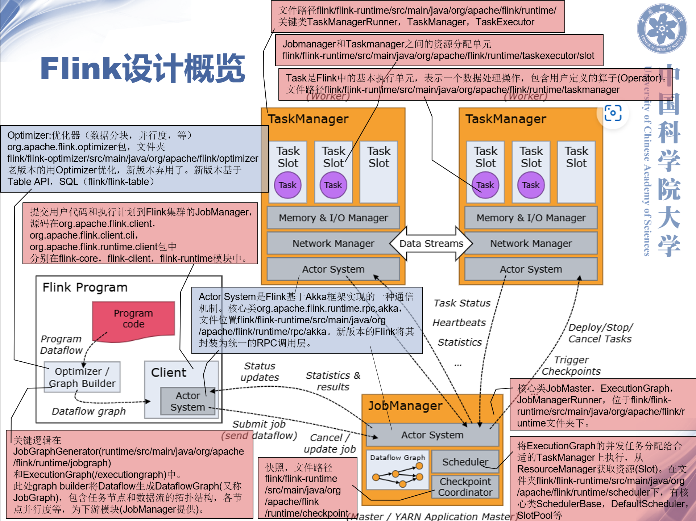

# 四. 高级设计意图

首先我们用下图来了解Flink的整体架构和功能。

<figure><caption>图【1】Flink整体架构</caption></figure>

***

然后，我们以Flink用到的Java设计模式来分析Flink的高级设计意图。

### 1. 模板模式

**含义：** 模板模式是一种行为型设计模式。模板模式定义了一个操作中的算法骨架，而将一些步骤延迟到子类中实现。这样可以允许子类在不改变算法结构的情况下，重新定义算法的某些特定步骤。

**例子：** 入口类entrypoint

<figure><caption>图【2】抽象模板类和具体实现子类的类图</caption></figure>

entrypoint.StandaloneSessionClusterEntrypoint类
```java
StandaloneSessionClusterEntrypoint entrypoint =
    new StandaloneSessionClusterEntrypoint(configuration)

ClusterEntrypoint.runClusterEntrypoint(entrypoint);
```

entrypoint类
```java
private void runCluster(Configuration configuration, PluginManager pluginManager) throws Exception {
    synchronized (lock) {
        initializeServices(configuration, pluginManager);
        final DispatcherResourceManagerComponentFactory
            dispatcherResourceManagerComponentFactory =
                createDispatcherResourceManagerComponentFactory(configuration);
    }
}
```

### 2. 工厂模式

**含义：** 工厂模式是一种创建型设计模式。在工厂模式中，对象的创建被委托给一个工厂对象，该工厂对象负责实例化对象。这样避免在客户端代码中直接通过 new 操作符创建，将对象创建的逻辑与使用对象的逻辑分离。

**例子：** defaultDispatcherResourceManagerComponentFactory，resourceManagerFactory，dispatcherFactory

<figure><caption>图【3】工厂模式类图</caption></figure>

```java
public class DefaultDispatcherResourceManagerComponentFactory implements DispatcherResourceManagerComponentFactory {
    public static DefaultDispatcherResourceManagerComponentFactory createSessionComponentFactory(ResourceManagerFactory<?> resourceManagerFactory) {
            return new DefaultDispatcherResourceManagerComponentFactory(
                DefaultDispatcherRunnerFactory.createSessionRunner(
                    SessionDispatcherFactory.INSTANCE),
                resourceManagerFactory,
                SessionRestEndpointFactory.INSTANCE);
    }
}
```

### 3. 生成器模式

**含义：** 生成器模式是一种创建型设计模式。它提供了一种清晰和灵活的方式来构建复杂对象。这种模式允许你通过添加多个组件或通过分步骤构造来创建对象，而不必一次性指定所有属性。

**例子：** jobGraphBuilder

<figure><caption>图【4】生成器模式代码</caption></figure>

### 4. 观察者模式

**含义：** 观察者模式是一种行为型设计模式。它定义了一种一对多的依赖关系，当一个对象的状态发生改变时，所有依赖于它的对象都会得到通知并自动更新。这种模式通常用于实现事件处理系统。

**例子：** heartbeat心跳信号

<figure><caption>图【5】观察者模式代码</caption></figure>

### 5. 快照模式

**含义：** 也称为备忘录模式（Memento Pattern），是一种行为设计模式，它允许在不破坏封装性的前提下，捕获一个对象的内部状态，并在该对象之外保存这个状态，以便以后当需要时能将该对象恢复到原先保存的状态。

**例子：** checkpoint快照

触发检查点
```java
private void triggerCheckpoint(CheckpointBarrier trigger) throws IOException {
    LOG.debug(
            "{}: Triggering checkpoint {} on the barrier announcement at {}.",
            taskName,
            trigger.getId(),
            trigger.getTimestamp());
    notifyCheckpoint(trigger);
}
```

保存状态
```java
private void restoreStateToCoordinators(
        final long checkpointId, final Map<OperatorID, OperatorState> operatorStates)
        throws Exception {
    for (OperatorCoordinatorCheckpointContext coordContext : coordinatorsToCheckpoint) {
        final OperatorState state = operatorStates.get(coordContext.operatorId());
        final ByteStreamStateHandle coordinatorState =
                state == null ? null : state.getCoordinatorState();
        final byte[] bytes = coordinatorState == null ? null : coordinatorState.getData();
        coordContext.resetToCheckpoint(checkpointId, bytes);
    }
}
```
        
### 6. 门面模式

**含义：** 也被称为外观模式，是设计模式中的一种结构型模式。它为子系统中的一组接口提供一个一致的高层接口，这个接口使得客户端可以访问子系统中的一群接口而不需要了解其复杂的内部结构。

**例子：** highAvailability类

提供高可用性相关的功能，如领导者选举

<figure><caption>图【6】门面模式代码</caption></figure>

### 7. 策略模式

**含义：** 策略模式是一种行为设计模式，它定义了一系列算法，将每一个算法封装起来，并使它们可以相互替换。策略模式让算法独立于使用它的客户而独立变化。

**例子：** 算子链

ALWAYS总是链在一起，NEVER从不链在一起，HEAD作为头节点链在一起

<figure><caption>图【7】策略模式代码</caption></figure>
